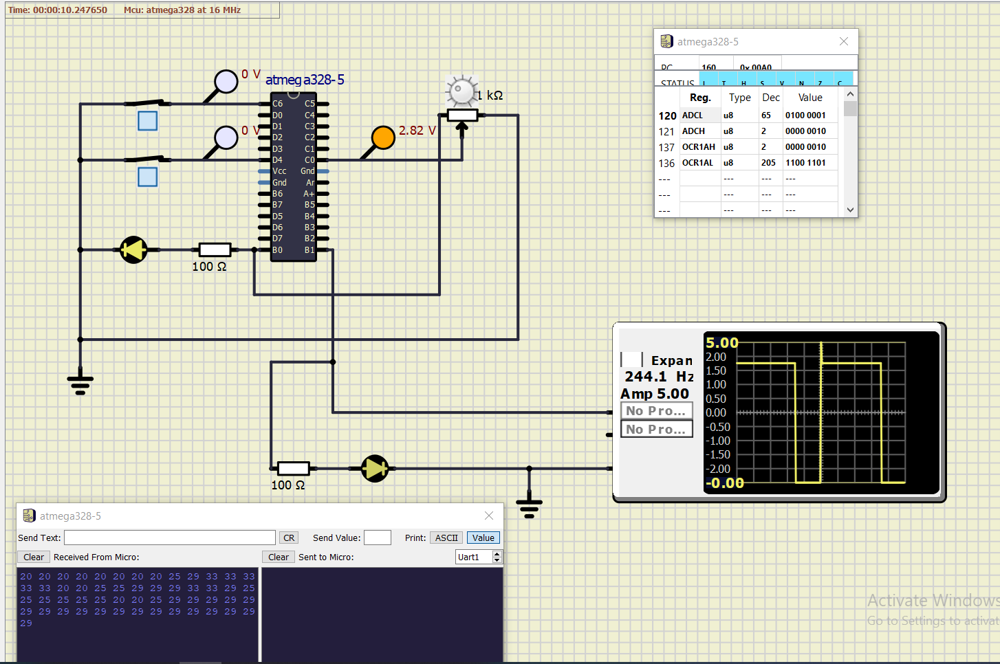

# Embedded C Programming Examples with Continuous Integration and Code Quality

# Heat Controller

## Activity 1 in Action

 

#### CI and Code Quality

|Build|Cppcheck|Codacy|
|:--:|:--:|:--:|
|||

